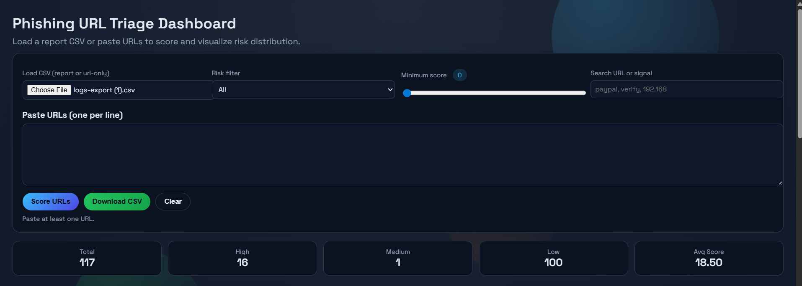
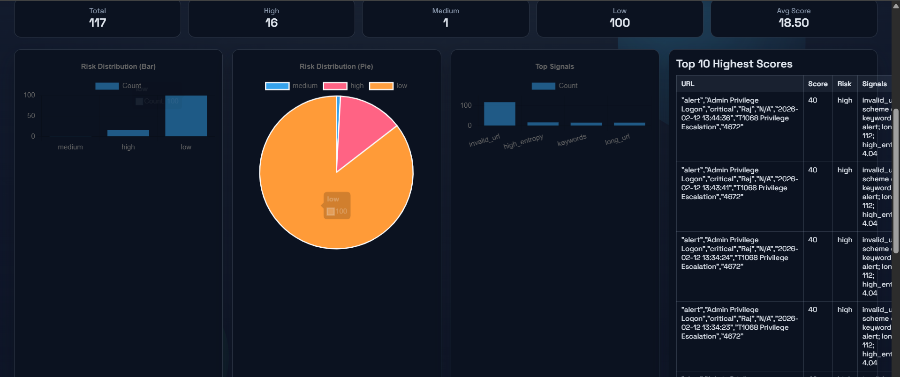
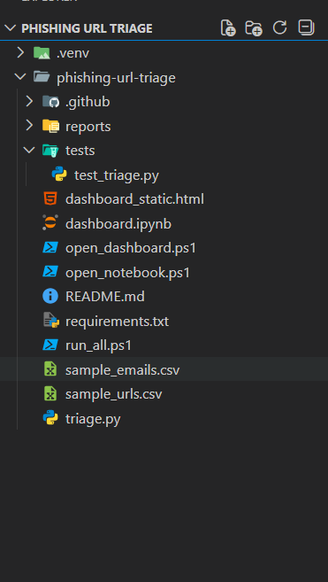

# Phishing URL Triage Tool

A small phishing URL triage tool that scores URLs for phishing risk and produces CSV + HTML reports.

## What it does
- Parses URLs from a CSV input file
- Scores each URL using simple detection signals
- Outputs a ranked CSV report and a readable HTML report

## Quick start
```bash
python triage.py --input sample_urls.csv --out reports
```

Enable threat intel + exports:
```bash
python triage.py --input sample_urls.csv --out reports --ti --export-ioc --analyst-report
```

Enable RDAP domain age + DNS checks:
```bash
python triage.py --input sample_urls.csv --out reports --rdap --dns
```

Email input with context:
```bash
python triage.py --email-input sample_emails.csv --out reports --ti --analyst-report
```

Generate alert and PDF reports:
```bash
python triage.py --input sample_urls.csv --out reports --export-alert --pdf-report
```
PDF export requires `reportlab`.

Watch a folder for new files:
```bash
python triage.py --watch-dir watch_inbox --out reports --ti --export-ioc --watch-interval 15
```

## Input format
A CSV file with a `url` column:

```csv
url
https://example.com/login
```

Email CSV with `url`, `sender`, and `subject` columns:
```csv
url,sender,subject
https://example.com/login,alerts@company.com,Password reset request
```

## Output
- `reports/report.csv`
- `reports/report.html`
- `reports/analyst_report.html` (when `--analyst-report` is used)
- `reports/analyst_report.pdf` (when `--pdf-report` is used)
- `reports/iocs.txt`, `reports/iocs.json`, `reports/stix_bundle.json` (when `--export-ioc` is used)
- `reports/alert.txt`, `reports/alert.json` (when `--export-alert` is used)
Reports may include a `labels` column for auto-categorization.

## Output screenshots



## Project structure


## Static dashboard (no server)
Open `dashboard_static.html` in your browser, then load `reports/report.csv` or paste URLs to score.
Use the "Download CSV" button to export results.

## PowerShell helpers
Run the full flow (generate report, then open dashboard):
```powershell
./run_all.ps1
```

Open the dashboard only:
```powershell
./open_dashboard.ps1
```

Open the Jupyter dashboard notebook:
```powershell
./open_notebook.ps1
```

## Tests
```bash
python -m unittest discover -s tests -p "test_*.py"
```

## Version 2
Focus: stronger enrichment, exports, automation, and dashboards.

### Changelog
- Added URLhaus threat intel enrichment and RDAP domain-age checks.
- Added DNS resolution check and MITRE ATT&CK mapping in reports.
- Added IOC exports (text/JSON/STIX) and alert exports (text/JSON).
- Added analyst summary HTML and PDF reports.
- Added watch mode for automatic triage of new files.
- Added static dashboard improvements and Jupyter dashboard filters.
- Added unit tests and CI workflow.
- Added CLI version banner and `--version` flag.
- Added auto-labeling for credential, banking, and cloud phishing.

## Resume bullets
- Built a phishing URL triage tool with heuristic scoring and explainable signals.
- Automated phishing risk ranking and generated analyst-friendly HTML/CSV reports.
- Implemented URL parsing, entropy checks, and suspicious pattern detection in Python.
- Added optional threat-intel enrichment and IOC/STIX exports for triage workflows.
- Included RDAP domain-age enrichment, MITRE mapping, and alert exports.

## Notes
This is a learning project and does not replace enterprise threat intel or email security systems.


Author 

Raj Shevde


Linkedin: www.linkedin.com/in/rajshevde